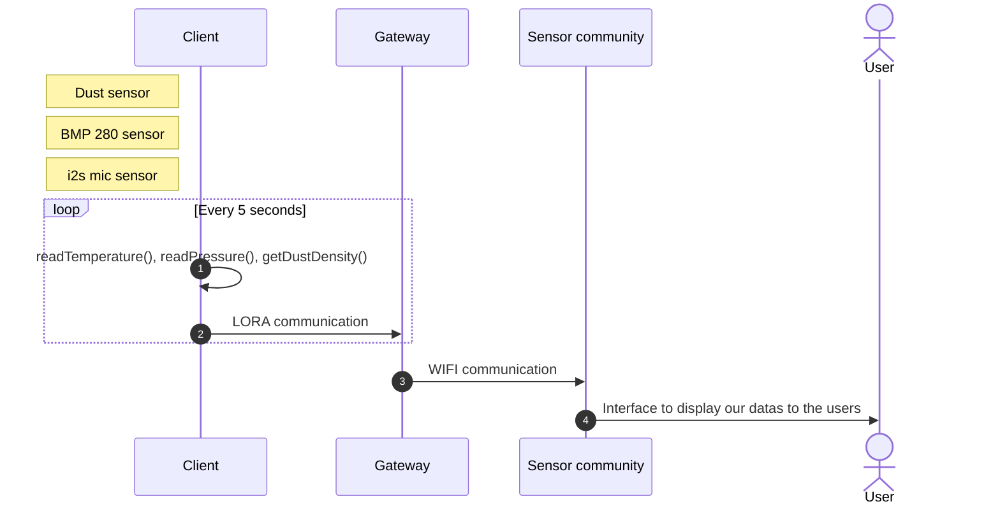

# Sequence diagram of the project

```mermaid
sequenceDiagram
    autonumber

    
    participant Client

    participant Gateway
    
    Note left of Client: Dust sensor
    Note left of Client: BMP 280 sensor
    Note left of Client: i2s mic sensor

    
    participant Sensor community
    actor User
    
    loop Every 5 seconds
    Client->>Client:readTemperature(), readPressure(), getDustDensity()
    Client->>Gateway: LORA communication
    end

    Gateway->>Sensor community: WIFI communication
    
       Sensor community->>User: Interface to display our datas to the users
```